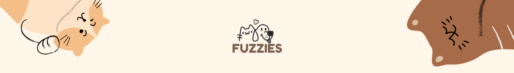
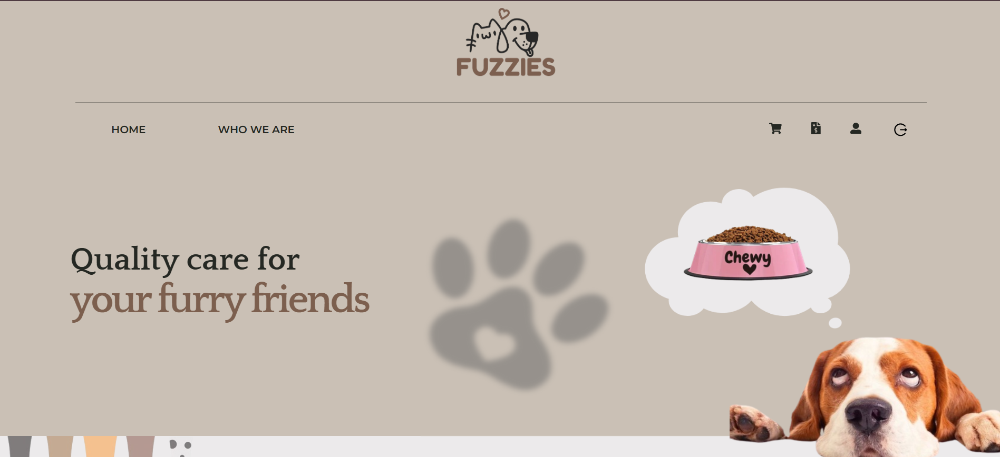
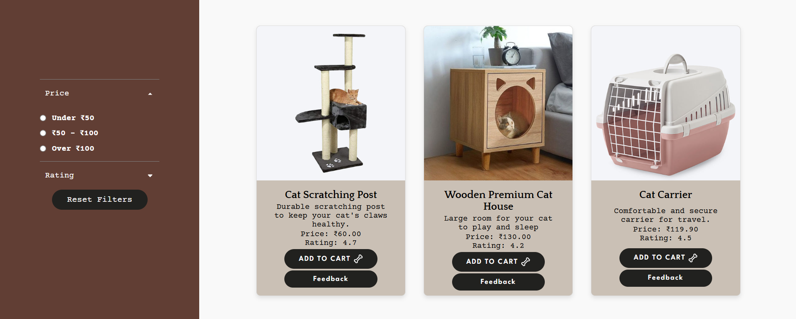
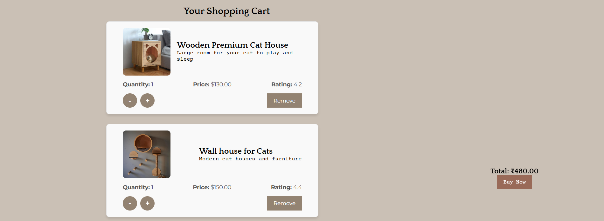

  

<h1 align="center">𝙵𝚞𝚣𝚣𝚒𝚎𝚜 🐾</h1>
<h3 align="center">𝙰 𝙵𝚞𝚕𝚕-𝚂𝚝𝚊𝚌𝚔 𝙴-𝚌𝚘𝚖𝚖𝚎𝚛𝚌𝚎 𝙿𝚕𝚊𝚝𝚏𝚘𝚛𝚖 𝚏𝚘𝚛 𝙿𝚎𝚝𝚜 🐶</h3>

𝙵𝚞𝚣𝚣𝚒𝚎𝚜 🐾 𝚒𝚜 𝚊 𝚏𝚞𝚕𝚕-𝚜𝚝𝚊𝚌𝚔 𝚎-𝚌𝚘𝚖𝚖𝚎𝚛𝚌𝚎 𝚙𝚕𝚊𝚝𝚏𝚘𝚛𝚖 𝚍𝚎𝚍𝚒𝚌𝚊𝚝𝚎𝚍 𝚝𝚘 𝚙𝚎𝚝𝚜 🐶.  
𝚄𝚜𝚎𝚛𝚜 𝚌𝚊𝚗 𝚋𝚛𝚘𝚠𝚜𝚎 𝚊𝚗𝚍 𝚙𝚞𝚛𝚌𝚑𝚊𝚜𝚎 𝚊𝚌𝚌𝚎𝚜𝚜𝚘𝚛𝚒𝚎𝚜, 𝚏𝚘𝚘𝚍, 𝚝𝚘𝚢𝚜, 𝚊𝚗𝚍 𝚘𝚝𝚑𝚎𝚛 𝚎𝚜𝚜𝚎𝚗𝚝𝚒𝚊𝚕𝚜.  
𝚃𝚑𝚎 𝚙𝚕𝚊𝚝𝚏𝚘𝚛𝚖 𝚏𝚎𝚊𝚝𝚞𝚛𝚎𝚜 𝚜𝚎𝚌𝚞𝚛𝚎 𝚊𝚞𝚝𝚑𝚎𝚗𝚝𝚒𝚌𝚊𝚝𝚒𝚘𝚗, 𝚊 𝚜𝚑𝚘𝚙𝚙𝚒𝚗𝚐 𝚌𝚊𝚛𝚝, 𝚙𝚛𝚘𝚍𝚞𝚌𝚝 𝚛𝚎𝚟𝚒𝚎𝚠𝚜, 𝚊𝚗𝚍 𝚊𝚗 𝚊𝚍𝚖𝚒𝚗 𝚍𝚊𝚜𝚑𝚋𝚘𝚊𝚛𝚍 𝚝𝚘 𝚖𝚊𝚗𝚊𝚐𝚎 𝚙𝚛𝚘𝚍𝚞𝚌𝚝𝚜 𝚊𝚗𝚍 𝚘𝚛𝚍𝚎𝚛𝚜.  
𝙱𝚞𝚒𝚕𝚝 𝚠𝚒𝚝𝚑 𝚖𝚘𝚍𝚎𝚛𝚗 𝚠𝚎𝚋 𝚝𝚎𝚌𝚑𝚗𝚘𝚕𝚘𝚐𝚒𝚎𝚜 𝚝𝚘 𝚎𝚗𝚜𝚞𝚛𝚎 𝚊 𝚜𝚎𝚊𝚖𝚕𝚎𝚜𝚜 𝚜𝚑𝚘𝚙𝚙𝚒𝚗𝚐 𝚎𝚡𝚙𝚎𝚛𝚒𝚎𝚗𝚌𝚎 𝚏𝚘𝚛 𝚙𝚎𝚝 𝚕𝚘𝚟𝚎𝚛𝚜 ❤️.

<h4 align="left">𝙻𝚒𝚟𝚎 𝙳𝚎𝚖𝚘 🌐</h4>

<a href="https://fuzzies-ecommerce.vercel.app/" target="_blank">Check out the live website here!</a>

<h4 align="left">𝚃𝚎𝚌𝚑 𝚂𝚝𝚊𝚌𝚔 💻</h4>

<h4 align="left">𝙵𝚎𝚊𝚝𝚞𝚛𝚎𝚜 ✨</h4>
<ul>
  <li>User signup and login with secure authentication</li>
  <li>Browse products by categories and filter by price and rating</li>
  <li>Leave and view product reviews / feedback</li>
  <li>Add products to shopping cart, update quantities, and delete items with total cost calculation</li>
  <li>Subscription system: enter email to receive updates, offers, and confirmation messages</li>
  <li>View bills and pay securely via Stripe</li>
  <li>Edit user profile and change profile picture</li>
  <li>Admin dashboard: add, edit, and remove products, manage orders and users (admin-only access)</li>
</ul>

<h4 align="left">𝚂𝚌𝚛𝚎𝚎𝚗𝚜𝚑𝚘𝚝𝚜 / 𝚄𝙸 𝙿𝚛𝚎𝚟𝚒𝚎𝚠 📸</h4>

<b>𝐇𝐨𝐦𝐞𝐩𝐚𝐠𝐞 🏠</b> 
  

<b>𝐏𝐫𝐨𝐝𝐮𝐜𝐭𝐬 𝐏𝐚𝐠𝐞 🛍️</b> 
  

<b>𝐂𝐚𝐫𝐭 𝐏𝐚𝐠𝐞 🛒</b> 
  

<h4 align="left">𝙸𝚗𝚜𝚝𝚊𝚕𝚕𝚊𝚝𝚒𝚘𝚗 / 𝚁𝚞𝚗 𝙻𝚘𝚌𝚊𝚕𝚕𝚢 ⚡</h4>

1. Clone the repository: 
<code>git clone https://github.com/your-username/fuzzies-ecommerce.git</code>  

2. You will have two folders: <code>frontend</code> and <code>fuzzybackend</code>.  

3. Install backend dependencies: 
<code>cd fuzzybackend && npm install</code>  

4. Install frontend dependencies: 
<code>cd ../frontend && npm install</code>  

5. Create a <code>.env</code> file in the <code>fuzzybackend</code> folder with the following variables (replace values with your own): 
<pre>
PORT=your-backend-port
MONGODB_URI=your-mongodb-uri
CLOUDINARY_CLOUD_NAME=your-cloudinary-cloud-name
CLOUDINARY_API_KEY=your-cloudinary-api-key
CLOUDINARY_API_SECRET=your-cloudinary-api-secret
JWT_SECRET=your-jwt-secret
STRIPE_SECRET_KEY=your-stripe-secret-key
EMAIL_USER=your-email
EMAIL_PASS=your-email-password
REACT_APP_API_URL=your-backend-api-url
</pre> 

6. Start the backend server: 
<code>npm start</code> (inside <code>fuzzybackend</code> folder)  

7. Start the frontend: 
<code>npm start</code> (inside <code>frontend</code> folder)  

8. Open <code>http://localhost:3000</code> in your browser to view the app.

<h4 align="left">𝙵𝚞𝚝𝚞𝚛𝚎 𝙸𝚖𝚙𝚛𝚘𝚟𝚎𝚖𝚎𝚗𝚝𝚜 🚀</h4>
<ul>
  <li>Create a Wishlist for users to save favorite products 💖</li>
  <li>Track orders with real-time updates 📦</li>
  <li>Enhanced product search and filters 🔍</li>
  <li>Detailed analytics for admin dashboard 📊</li>
</ul>

<h4 align="left">𝙲𝚘𝚗𝚝𝚊𝚌𝚝 / 𝙰𝚋𝚘𝚞𝚝 𝙼𝚎 📬</h4>

Developed by <b>Bhavika</b> – <a href="https://linkedin.com/in/bhavikachopra06" target="_blank">LinkedIn</a> | <a href="https://github.com/bhavikachopra06" target="_blank">GitHub</a>

